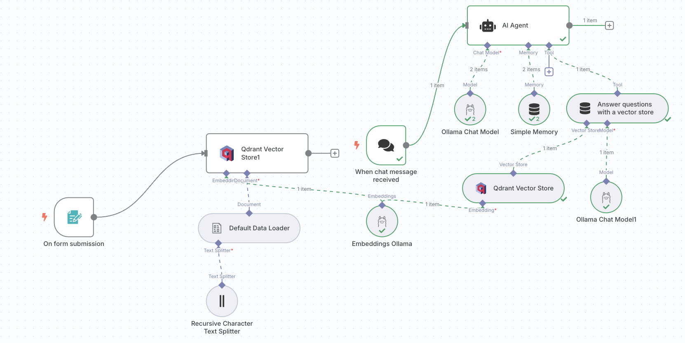

# Make n8n + ollama + Qdrant RAG System

<br>

# 1. n8n install
### 1-1. make docker-compose.yml
    ```
    version: '3.8'

    volumes:
    db_storage:
    n8n_storage:

    services:
    postgres:
        image: postgres:16
        restart: always
        environment:
        - POSTGRES_USER
        - POSTGRES_PASSWORD
        - POSTGRES_DB
        - POSTGRES_NON_ROOT_USER
        - POSTGRES_NON_ROOT_PASSWORD
        volumes:
        - ./db_storage:/var/lib/postgresql/data
        - ./init-data.sh:/docker-entrypoint-initdb.d/init-data.sh
        healthcheck:
        test: ['CMD-SHELL', 'pg_isready -h localhost -U ${POSTGRES_USER} -d ${POSTGRES_DB}']
        interval: 5s
        timeout: 5s
        retries: 10

     n8n:
        image: docker.n8n.io/n8nio/n8n
        restart: always
        environment:
        - DB_TYPE=postgresdb
        - DB_POSTGRESDB_HOST=postgres
        - DB_POSTGRESDB_PORT=5432
        - DB_POSTGRESDB_DATABASE=${POSTGRES_DB}
        - DB_POSTGRESDB_USER=${POSTGRES_NON_ROOT_USER}
        - DB_POSTGRESDB_PASSWORD=${POSTGRES_NON_ROOT_PASSWORD}
        - GENERIC_TIMEZONE=${GENERIC_TIMEZONE}
        ports:
        - 5678:5678
        links:
        - postgres
        volumes:
        - ./n8n_storage:/home/node/.n8n
        depends_on:
        postgres:
            condition: service_healthy
### 1-2. make dotenv
    ```
    POSTGRES_USER={userID}
    POSTGRES_PASSWORD={userPassword}
    POSTGRES_DB={DBName}

    POSTGRES_NON_ROOT_USER={userID}
    POSTGRES_NON_ROOT_PASSWORD={userPassword}
    GENERIC_TIMEZONE=Asia/Seoul
### 1-3. make init-data.sh
    ```
    #!/bin/bash
    set -e;

    if [ -n "${POSTGRES_NON_ROOT_USER:-}" ] && [ -n "${POSTGRES_NON_ROOT_PASSWORD:-}" ]; then
        psql -v ON_ERROR_STOP=1 --username "$POSTGRES_USER" --dbname "$POSTGRES_DB" <<-EOSQL
            CREATE USER ${POSTGRES_NON_ROOT_USER} WITH PASSWORD '${POSTGRES_NON_ROOT_PASSWORD}';
            GRANT ALL PRIVILEGES ON DATABASE ${POSTGRES_DB} TO ${POSTGRES_NON_ROOT_USER};
            GRANT CREATE ON SCHEMA public TO ${POSTGRES_NON_ROOT_USER};
        EOSQL
    else
        echo "SETUP INFO: No Environment variables given!"
    fi

### 1-4. make volume dir
```    
mkdir db_storage
mkdir n8n_storage
```
### 1-5.
```
chmod +x ./init-data.sh
```
### 1-6.
```
docker compose up -d
```

<br>

# 2. ollama + LLM setting
### 2-1. ollama install 
```
brew install ollama
```
### 2-2. pull LLM
<https://ollama.com/search?c=tools> <br>
<https://ollama.com/search?c=embedding>
```
ollama pull llama3.2:3b #LLM (tools 지원 모델 사용)
ollama pull bge-m3:latest #임베딩 모델 (embedding 지원 모델 사용)
```
<br>

# 3. VectorDB init (Qdrant)
### 3-1. make docker-compose.yml
```
version: '3.8'

services:
  qdrant:
    image: qdrant/qdrant:latest
    restart: always
    container_name: qdrant
    ports:
      - 6333:6333
      - 6334:6334
    expose:
      - 6333
      - 6334
      - 6335
    configs:
      - source: qdrant_config
        target: /qdrant/config/production.yaml
    volumes:
      - ./qdrant_data:/qdrant/storage

configs:
  qdrant_config:
    content: |
      log_level: INFO
```
### 3-2.
```
docker compose up -d
```
<br>

# 이슈사항
1. n8n에서 localhost 참조방법
    - 도커로 구현 시 localhost 참조를 못하는 이슈
        - http://host.docker.internal:11434 로 사용
